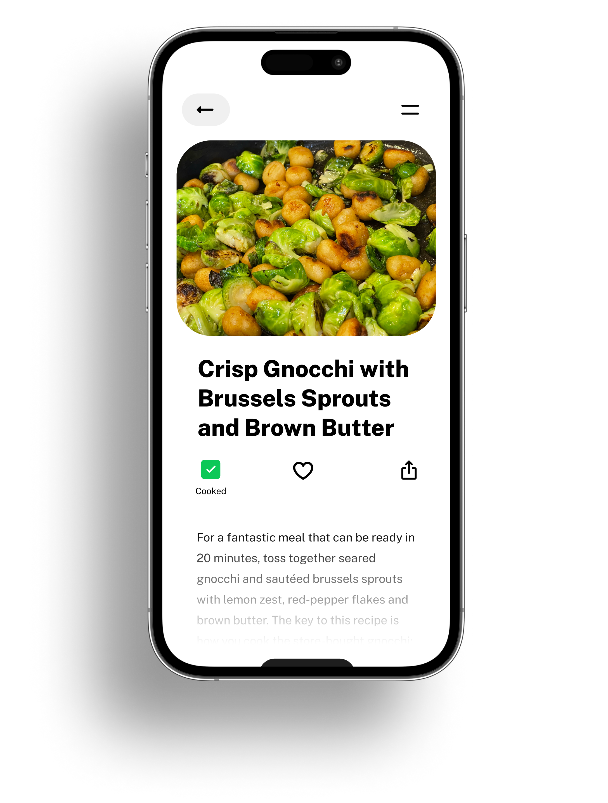

# My Cookbook

A collection of my recipes and a beautiful Next.js app to use them in the kitchen.

## Usage

Create or add recipes in the [Cooklang document format](https://cooklang.org/).

Run `npm run build` to build the site.

I don't know what the CI/deployment pipeline will look like yet, but I'm sure it will be great!

## Goals

Storing a catalog of recipes is a pain in the butt and it shouldn't be.

Recipes should be easy to read to read and easy to share. A good digital recipe catalog will be both.

The most important quality of a recipe catalog, however, is *permanence*.

It isn't locked behind a specific account in a specific app; it isn't a ridiculous list of bookmarks in a browser; it doesn't disappear when a website goes down.

Git repositories are a great solution to the problem of keeping recipes; they only lack a good interface for reading and searching through them.

I'm combining Git as a data store with GitHub Pages as a static site host and Next.js as a static site generator to create the best recipe catalog tool to exist.

## About my recipes

The recipes in this repository are a mix: some are my own, some are family recipes or recipes with no known origin, and some are from cookbooks or adapted from other sources.

## Ideas

Some things that I'm considering implementing but aren't priorities for my own use or for 'launching'.

- Localization options